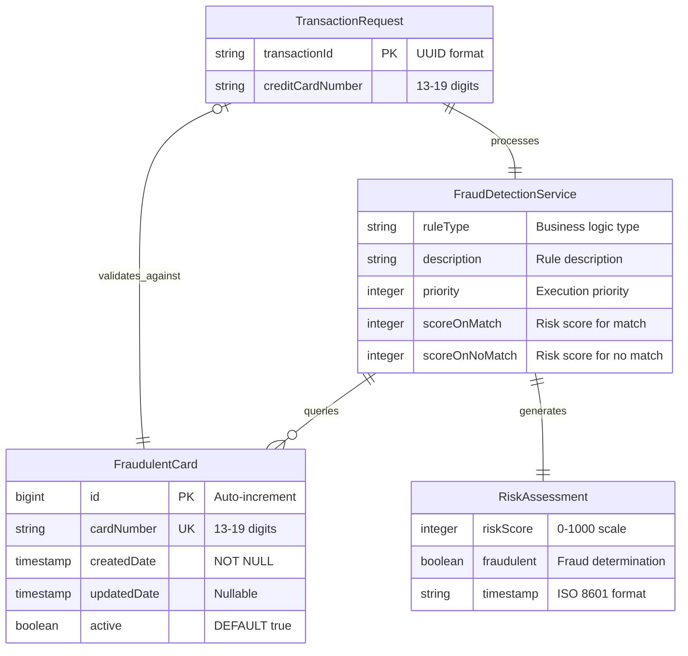

# Data Model: Initial Fraud Service Processing Implementation

**Date**: 2025-10-21  
**Feature**: 001-implement-initial-fraud-service-processing  
**Purpose**: Entity definitions and data relationships for fraud detection service

## Core Entities

### TransactionRequest

**Description**: Input payload for fraud risk assessment containing transaction and payment details

**Fields**:

- `transactionId` (String, required): Unique transaction identifier in UUID format (36 characters)
- `creditCardNumber` (String, required): Payment card number for fraud evaluation (13-19 digits, numeric only)

**Validation Rules**:

- Transaction ID must conform to UUID format: `^[0-9a-fA-F]{8}-[0-9a-fA-F]{4}-[0-9a-fA-F]{4}-[0-9a-fA-F]{4}-[0-9a-fA-F]{12}$`
- Credit card number must be 13-19 digits, numeric characters only: `^[0-9]{13,19}$`
- Both fields are mandatory and cannot be null or empty

**JSON Schema**:

```json
{
  "type": "object",
  "properties": {
    "transactionId": {
      "type": "string",
      "pattern": "^[0-9a-fA-F]{8}-[0-9a-fA-F]{4}-[0-9a-fA-F]{4}-[0-9a-fA-F]{4}-[0-9a-fA-F]{12}$",
      "description": "UUID format transaction identifier"
    },
    "creditCardNumber": {
      "type": "string",
      "pattern": "^[0-9]{13,19}$",
      "description": "Credit card number for fraud assessment"
    }
  },
  "required": ["transactionId", "creditCardNumber"],
  "additionalProperties": false
}
```

### RiskAssessment

**Description**: Output response containing fraud risk evaluation results and processing metadata

**Fields**:

- `riskScore` (Integer, required): Numerical risk score (0-1000 scale, where >1000 indicates fraud)
- `fraudulent` (Boolean, required): Binary fraud determination based on risk score evaluation
- `timestamp` (String, required): Processing timestamp in ISO 8601 format (UTC timezone)

**Business Rules**:

- Risk score 0: Clean transaction (credit card not in fraudulent cards table)
- Risk score 1000: Fraudulent transaction (credit card matches known fraudulent cards)
- Fraudulent flag set to `true` when risk score exceeds 1000, `false` otherwise
- Timestamp recorded at moment of risk assessment completion

**JSON Schema**:

```json
{
  "type": "object",
  "properties": {
    "riskScore": {
      "type": "integer",
      "minimum": 0,
      "maximum": 1000,
      "description": "Risk score on 0-1000 scale"
    },
    "fraudulent": {
      "type": "boolean",
      "description": "Binary fraud determination"
    },
    "timestamp": {
      "type": "string",
      "format": "date-time",
      "description": "ISO 8601 timestamp of risk assessment"
    }
  },
  "required": ["riskScore", "fraudulent", "timestamp"],
  "additionalProperties": false
}
```

### FraudulentCard

**Description**: Database entity representing credit card numbers flagged as fraudulent for blocking transactions

**Fields**:

- `id` (Long, primary key): Auto-generated unique identifier for database record
- `cardNumber` (String, unique, required): Credit card number flagged as fraudulent (13-19 digits)
- `createdDate` (LocalDateTime, required): Timestamp when card was added to fraudulent list
- `updatedDate` (LocalDateTime): Timestamp of last modification (null if never updated)
- `active` (Boolean, required): Flag indicating if fraud rule is currently active (default: true)

**Database Constraints**:

- Primary key: `id` (auto-increment)
- Unique constraint: `card_number` (prevents duplicate fraudulent card entries)
- Not null constraints: `card_number`, `created_date`, `active`
- Index: `idx_card_number` for fast lookup during fraud detection

**Table Schema (PostgreSQL)**:

```sql
CREATE TABLE fraudulent_cards (
    id BIGSERIAL PRIMARY KEY,
    card_number VARCHAR(19) NOT NULL UNIQUE,
    created_date TIMESTAMP NOT NULL DEFAULT CURRENT_TIMESTAMP,
    updated_date TIMESTAMP,
    active BOOLEAN NOT NULL DEFAULT TRUE
);

CREATE INDEX idx_card_number ON fraudulent_cards (card_number);
```

### FraudRule (Business Logic Entity)

**Description**: Encapsulates fraud detection business logic for evaluating transaction risk

**Properties**:

- `ruleType`: "KNOWN_FRAUDULENT_CARD" (initial implementation)
- `description`: "Check transaction against database of known fraudulent credit cards"
- `priority`: 1 (highest priority for immediate blocking)
- `scoreOnMatch`: 1000 (immediate fraud classification)
- `scoreOnNoMatch`: 0 (clean transaction)

**Evaluation Logic**:

1. Extract credit card number from transaction request
2. Query `fraudulent_cards` table for exact match on `card_number` where `active = true`
3. Return 1000 risk score if match found, 0 if no match
4. Handle database errors by returning 0 risk score (fail-safe behavior)

## Entity Relationships

### Entity Relationship Diagram



### Data Flow Diagram

```text
TransactionRequest 
    ↓ (input validation)
FraudDetectionService
    ↓ (fraud rule evaluation)
FraudulentCardRepository
    ↓ (database query)
FraudulentCard (table lookup)
    ↓ (risk calculation)
RiskAssessment (response)
```

### Relationship Descriptions

- **TransactionRequest → FraudDetectionService**: One-to-one processing relationship where each request generates exactly one risk assessment
- **FraudDetectionService → FraudulentCard**: Many-to-one lookup relationship where service queries fraudulent cards table for each transaction
- **FraudRule → FraudulentCard**: One-to-many logical relationship where single rule type can match multiple fraudulent cards
- **FraudDetectionService → RiskAssessment**: One-to-one output relationship where each evaluation produces exactly one assessment

## State Transitions

### Transaction Processing States

1. **Received**: Transaction request received and initial validation passed
2. **Evaluating**: Fraud rules being applied and database queries in progress  
3. **Assessed**: Risk score calculated and fraud determination completed
4. **Responded**: Risk assessment response sent to client

### Error States

- **Validation Failed**: Invalid input format detected, return 400 Bad Request
- **Database Error**: Database connectivity issue, assign 0 risk score (fail-safe)
- **Processing Error**: Unexpected error during evaluation, return 500 Internal Server Error

## Data Validation and Security

### Input Validation Strategy

- **Controller Level**: Bean Validation annotations for format validation
- **Service Level**: Business rule validation and sanitization
- **Repository Level**: Database constraint enforcement

### Security Considerations

- **No Sensitive Data Storage**: Credit card numbers not persisted in application logs
- **Audit Trail**: Transaction processing logged with correlation IDs (excluding sensitive data)
- **Data Encryption**: Database connections encrypted with TLS 1.3
- **Access Control**: Repository operations restricted to service layer only

### Performance Optimization

- **Database Indexing**: Single index on `card_number` for O(1) lookup performance
- **Connection Pooling**: HikariCP for efficient database connection management
- **Caching Strategy**: No caching for initial implementation (fraud data must be current)
- **Query Optimization**: Simple SELECT query with single WHERE clause for maximum performance

---

**Data Model Complete**: All entities defined with validation rules, relationships mapped, and database schema specified for Phase 1 contract generation.
